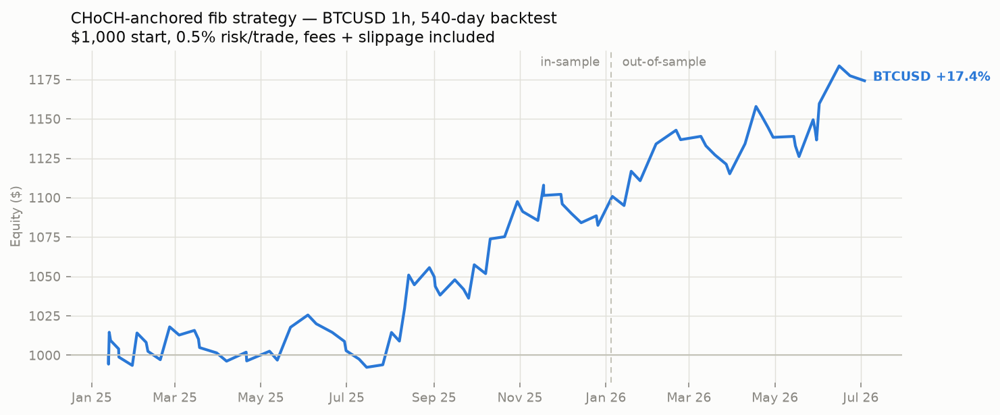
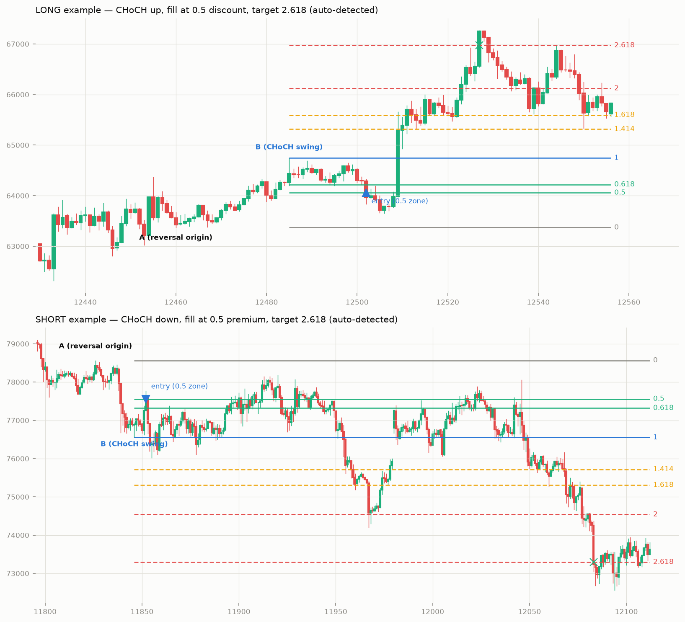

# CHoCH-anchored fib strategy — backtest report

Generated: 2026-07-03 15:20 UTC

The setup (user's idea): when a trend changes character (CHoCH — a
close breaks the last lower-high / higher-low), anchor a fib to the
reversal swing A->B. Enter the 0.5 discount retest with a limit,
stop below A (reversal invalidated), target the **2.618 extension
measured from A** — trend changes run far, so unlike ordinary
swings (where 1.618 wins), 2.618 is the best target here.

| symbol   | phase              |   trades |   trades_per_day |   win_rate_% |   profit_factor |   avg_win_$ |   avg_loss_$ |   total_return_% |   max_drawdown_% |
|:---------|:-------------------|---------:|-----------------:|-------------:|----------------:|------------:|-------------:|-----------------:|-----------------:|
| BTCUSD   | full 540d          |       84 |             0.16 |         38.1 |            1.58 |       14.76 |        -5.73 |            17.42 |            -3.24 |
| BTCUSD   | in-sample 360d     |       58 |             0.16 |         37.9 |            1.5  |       13.76 |        -5.61 |            10.08 |            -3.24 |
| BTCUSD   | out-of-sample 180d |       26 |             0.14 |         38.5 |            1.76 |       16.96 |        -6.02 |             6.67 |            -2.75 |



Auto-detected examples with the levels drawn (long and short):



## Verdict

Validated on BTCUSD across the whole k=5 config family in BOTH
walk-forward phases (not just one lucky cell). **ETHUSD did NOT
validate** — this is a BTC strategy; keep DELTA_SYMBOLS=BTCUSD.
~1 trade per week; low win rate, big asymmetric payoff (risk 0.5 of
the swing to make ~2.1x the swing). Paper-trade before size.

```bash
DELTA_STRATEGY=choch DELTA_SYMBOLS=BTCUSD python run_bot.py
```
