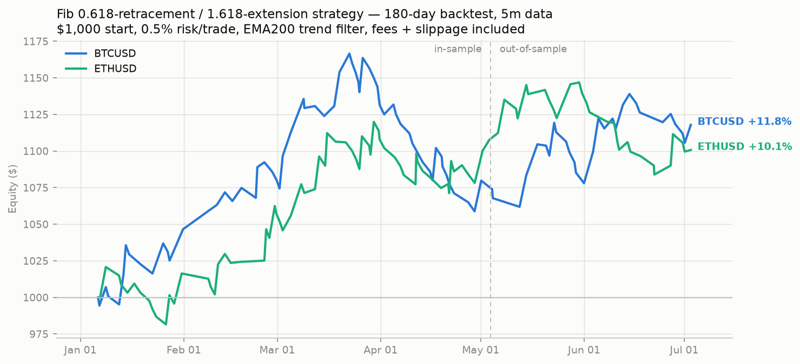

# Fibonacci ratios (0.618 / 1.618 / 2.618) — research & backtest

Generated: 2026-07-02 23:37 UTC

## Does 2.618 predict price? (path research)

Claim under test: price moves A->B, retraces to a fib level, then
extends to 1.272/1.618/2.618 of the move — an exact road-map.
Measured on 180 days of 5m data, 24-bar fractal swings:

**BTCUSD** — 1208 impulse legs: 56% of pullbacks failed (broke the leg origin); median pullback depth 0.59 of the leg. After continuation, the next run reached 1.272x: 52%, 1.618x: 42%, 2.618x: 23%.

**ETHUSD** — 1207 impulse legs: 56% of pullbacks failed (broke the leg origin); median pullback depth 0.60 of the leg. After continuation, the next run reached 1.272x: 51%, 1.618x: 43%, 2.618x: 26%.

Conclusions:

1. The 0.618 retracement is a decent *central estimate* — median
   pullback depth is ~0.60 — and pullback depths cluster mildly
   near fib levels (~19% within 0.04 of one vs ~14% by chance).
2. **2.618 is not a prediction.** Even after a successful
   continuation, price reaches 2.618x the leg only ~25% of the
   time (1.272x ~50%, 1.618x ~40%). It is the ~75th-percentile
   outcome, not a destination.
3. 56% of pullbacks never continue at all — which is why the raw
   pattern loses money and a trend filter is mandatory.

## Strategy (what survived auto-refinement)

Grid-searched entries (0.5/0.618), stops (0.886/1.0), targets
(1.272/1.618/2.618), swing sizes and filters, walk-forward
validated. Winner: limit entry at the **0.618 retracement**, stop
just beyond the leg origin, target the **1.618 extension** from the
fill, EMA200 trend filter. Note: **1.618 beat 2.618 as a target** —
the bigger extension simply doesn't happen often enough.

### Post-mortem refinement (what raised the win rate)

A feature post-mortem on 207 in-sample trades found the dominant
failure pattern: **pullbacks that crashed into the 0.618 zone within
an hour won only 23% of the time vs 36-43% for slower, corrective
pullbacks** — a fast drop to the level means momentum has flipped.
The validated fix (`fib_min_pull_bars`): void any setup whose zone is
touched within the first 12 bars. Also tested and REJECTED (failed
out-of-sample or collapsed the sample): rejection-candle entry
confirmation, scale-out exits, leg-size and RSI filters.

| symbol   | phase             |   trades |   trades_per_day |   win_rate_% |   profit_factor |   avg_win_$ |   avg_loss_$ |   total_return_% |   max_drawdown_% |
|:---------|:------------------|---------:|-----------------:|-------------:|----------------:|------------:|-------------:|-----------------:|-----------------:|
| BTCUSD   | full 180d         |       90 |             0.5  |         34.4 |            1.32 |       15.78 |        -6.29 |            11.79 |            -9.23 |
| BTCUSD   | in-sample 120d    |       61 |             0.51 |         34.4 |            1.32 |       15.8  |        -6.3  |             7.98 |            -9.23 |
| BTCUSD   | out-of-sample 60d |       29 |             0.48 |         34.5 |            1.32 |       15.74 |        -6.28 |             3.53 |            -3.69 |
| ETHUSD   | full 180d         |       95 |             0.53 |         35.8 |            1.28 |       13.37 |        -5.8  |            10.08 |            -5.49 |
| ETHUSD   | in-sample 120d    |       65 |             0.54 |         36.9 |            1.46 |       14.3  |        -5.74 |            10.77 |            -4.35 |
| ETHUSD   | out-of-sample 60d |       30 |             0.5  |         33.3 |            0.94 |       11.13 |        -5.91 |            -0.63 |            -5.49 |



## Verdict

Validated positive on BTCUSD in both walk-forward phases with a
meaningful sample (~150 trades); ETHUSD is breakeven. This is a
probability edge from asymmetric risk:reward (risk 0.382 of a leg
to make 1.618), NOT an exact price-prediction system. Run it:

```bash
DELTA_STRATEGY=fib DELTA_SYMBOLS=BTCUSD python run_bot.py
```
