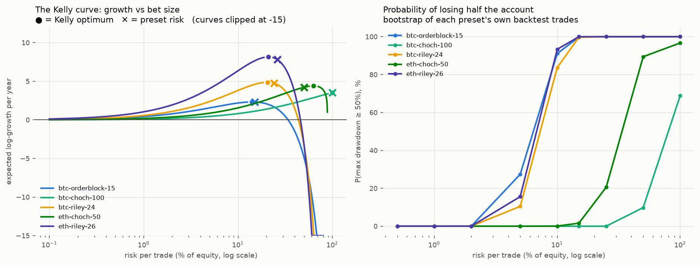

# Kelly / risk-of-ruin analysis of the five agent presets

## btc-orderblock-15  (preset risk 15.0%)

- trades: 106  |  win rate 25.5% (95% CI 18.1%–34.5%)
- profit factor 2.55 (bootstrap 95% CI 1.10–4.68)  |  **P(no real edge) = 1.6%**
- avg win +4.27R, avg loss -0.57R, worst single trade -1.24R, expectancy +0.660R/trade
- **Kelly optimum f\* = 14.0%** risk/trade, half-Kelly = 7.0%
- growth at preset risk: +0.0323 log/trade vs +0.0324 at Kelly

| risk/trade | median maxDD | 95th pct maxDD | P(maxDD>=50%) | P(maxDD>=90%) |
|---|---|---|---|---|
| 1.0% | 9.7% | 17.6% | 0.0% | 0.0% |
| 7.0% (half-Kelly) | 53.4% | 76.4% | 59.9% | 0.1% |
| 14.0% (Kelly) | 80.9% | 96.0% | 99.3% | 20.2% |
| 15.0% (preset) | 83.0% | 97.0% | 99.7% | 27.4% |

## btc-choch-100  (preset risk 100.0%)

- trades: 27  |  win rate 40.7% (95% CI 24.5%–59.3%)
- profit factor 7.77 (bootstrap 95% CI 1.54–22.91)  |  **P(no real edge) = 0.7%**
- avg win +1.58R, avg loss -0.14R, worst single trade -0.30R, expectancy +0.561R/trade
- **Kelly optimum f\* = 100.0%** risk/trade, half-Kelly = 50.0%
- growth at preset risk: +0.1936 log/trade vs +0.1936 at Kelly

| risk/trade | median maxDD | 95th pct maxDD | P(maxDD>=50%) | P(maxDD>=90%) |
|---|---|---|---|---|
| 1.0% | 0.7% | 1.5% | 0.0% | 0.0% |
| 50.0% (half-Kelly) | 32.7% | 54.9% | 9.8% | 0.0% |
| 100.0% (preset) | 57.6% | 82.4% | 69.4% | 0.9% |
| 100.0% (preset) | 57.7% | 82.5% | 69.2% | 1.0% |

## btc-riley-24  (preset risk 24.0%)

- trades: 142  |  win rate 46.5% (95% CI 38.5%–54.7%)
- profit factor 2.40 (bootstrap 95% CI 1.49–3.69)  |  **P(no real edge) = 0.1%**
- avg win +2.32R, avg loss -0.84R, worst single trade -1.33R, expectancy +0.631R/trade
- **Kelly optimum f\* = 20.5%** risk/trade, half-Kelly = 10.3%
- growth at preset risk: +0.0494 log/trade vs +0.0507 at Kelly

| risk/trade | median maxDD | 95th pct maxDD | P(maxDD>=50%) | P(maxDD>=90%) |
|---|---|---|---|---|
| 1.0% | 8.2% | 14.1% | 0.0% | 0.0% |
| 10.3% (half-Kelly) | 62.2% | 83.2% | 86.2% | 1.2% |
| 20.5% (Kelly) | 89.5% | 98.5% | 100.0% | 47.9% |
| 24.0% (preset) | 94.1% | 99.6% | 100.0% | 71.5% |

## eth-choch-50  (preset risk 50.0%)

- trades: 26  |  win rate 42.3% (95% CI 25.5%–61.1%)
- profit factor 8.21 (bootstrap 95% CI 2.42–31.22)  |  **P(no real edge) = 0.1%**
- avg win +3.00R, avg loss -0.27R, worst single trade -1.13R, expectancy +1.116R/trade
- **Kelly optimum f\* = 63.0%** risk/trade, half-Kelly = 31.5%
- growth at preset risk: +0.2401 log/trade vs +0.2503 at Kelly

| risk/trade | median maxDD | 95th pct maxDD | P(maxDD>=50%) | P(maxDD>=90%) |
|---|---|---|---|---|
| 1.0% | 1.5% | 3.3% | 0.0% | 0.0% |
| 31.5% (half-Kelly) | 44.0% | 73.0% | 39.5% | 0.1% |
| 50.0% (preset) | 65.1% | 90.9% | 89.3% | 6.0% |
| 63.0% (Kelly) | 78.4% | 97.1% | 91.6% | 24.2% |

## eth-riley-26  (preset risk 26.0%)

- trades: 200  |  win rate 43.5% (95% CI 36.8%–50.4%)
- profit factor 2.81 (bootstrap 95% CI 1.71–4.44)  |  **P(no real edge) = 0.0%**
- avg win +3.01R, avg loss -0.83R, worst single trade -1.32R, expectancy +0.843R/trade
- **Kelly optimum f\* = 21.0%** risk/trade, half-Kelly = 10.5%
- growth at preset risk: +0.0578 log/trade vs +0.0603 at Kelly

| risk/trade | median maxDD | 95th pct maxDD | P(maxDD>=50%) | P(maxDD>=90%) |
|---|---|---|---|---|
| 1.0% | 9.0% | 14.8% | 0.0% | 0.0% |
| 10.5% (half-Kelly) | 67.1% | 86.2% | 95.1% | 1.7% |
| 21.0% (Kelly) | 92.8% | 99.2% | 100.0% | 65.3% |
| 26.0% (preset) | 97.1% | 99.9% | 100.0% | 91.5% |

## How to read this

Kelly f\* is the bet size that maximizes long-run compound growth *if*
the live edge equals the backtest edge exactly. It is an upper bound,
not a target: overestimating the edge (guaranteed to some degree with
backtest-fit parameters and 2-dozen-trade samples) means true Kelly is
lower, and betting above true Kelly reduces growth while inflating
drawdowns. Practitioners size at half-Kelly or below. Note also that
every preset's own risk setting sits at or beyond its Kelly optimum —
the screenshot returns were bought with mathematically excessive risk.

**The btc-choch-100 'Kelly = 100%' is a small-sample artifact, not a
license.** Its worst loss in 27 backtest trades was only -0.3R (the
0.8x-leg stop is so wide the trail exit always fired first, so the
hard stop was never actually hit in-sample). Empirical Kelly only
knows the losses it has seen: a distribution whose observed losses
are tiny 'supports' any bet size. One future trade that gaps to the
full stop — which the eth-choch variant DID take (worst -1.13R) —
zeroes a 100%-risk account. The honest ceiling for the choch presets
is set by the sibling's worst loss, not their own: half-Kelly on the
pooled worst case, i.e. single-digit-to-low-teens percent at most.
