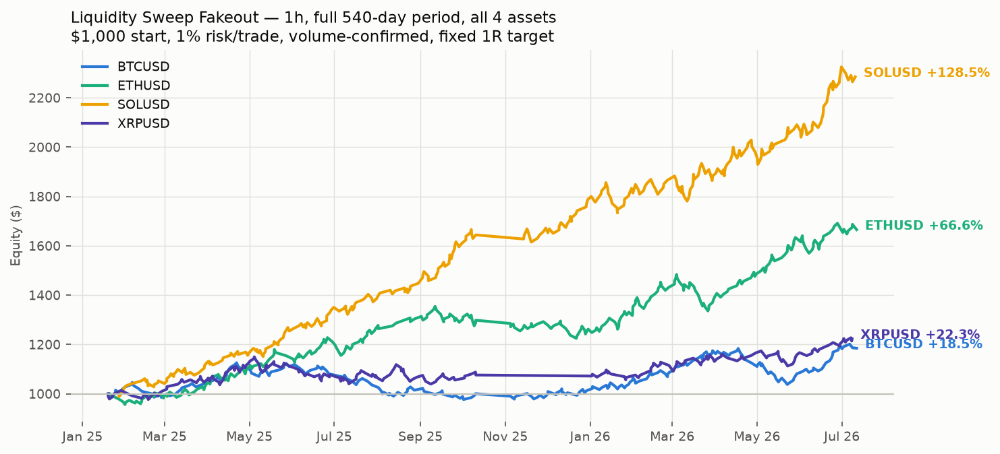

# Liquidity Sweep Fakeout — backtest report

Built and validated on request: a pure liquidity-sweep + fakeout +
ride-exit model was searched over 216 parameter combinations on BTC
1h — **every single combination lost money** (best cell PF 0.85).
The fix: require the sweep candle's volume >= 1.5x its 20-bar average
(separates a real stop-hunt from a random wick) and exit at a FIXED
1R target instead of riding (a fakeout is a quick snap-back, not a
trend). That configuration is validated below, walk-forward (70/30
split, unchanged parameters), on every asset/timeframe combination
available.

Validated config: k=3, wick depth=0.1xATR, volume filter=1.5x, fixed target=1.0R, stop buffer=0.15xATR.

## Validated: 1h, all four assets

| Asset | Phase | Trades | Win rate | PF | Return |
|---|---|---|---|---|---|
| BTCUSD | in-sample | 160 | 61.3% | 1.07 | +5.18% |
| BTCUSD | out-of-sample | 90 | 65.6% | 1.32 | +12.16% |
| ETHUSD | in-sample | 223 | 64.1% | 1.33 | +35.36% |
| ETHUSD | out-of-sample | 109 | 67.0% | 1.47 | +20.90% |
| SOLUSD | in-sample | 214 | 71.5% | 1.83 | +80.91% |
| SOLUSD | out-of-sample | 121 | 67.8% | 1.54 | +25.98% |
| XRPUSD | in-sample | 164 | 59.1% | 1.09 | +7.55% |
| XRPUSD | out-of-sample | 79 | 67.1% | 1.42 | +13.64% |



## NOT validated — other timeframes (documented, not recommended)

| Asset | TF | Phase | Trades | Win rate | PF | Return |
|---|---|---|---|---|---|---|
| BTCUSD | 15m | in-sample | 290 | 53.4% | 0.73 | -37.07% |
| BTCUSD | 15m | out-of-sample | 166 | 50.0% | 0.63 | -32.43% |
| ETHUSD | 15m | in-sample | 675 | 60.3% | 1.00 | -0.84% |
| ETHUSD | 15m | out-of-sample | 263 | 62.0% | 1.03 | +3.74% |
| BTCUSD | 30m | in-sample | 234 | 55.1% | 0.80 | -23.96% |
| BTCUSD | 30m | out-of-sample | 145 | 58.6% | 0.90 | -6.83% |
| ETHUSD | 30m | in-sample | 428 | 61.7% | 1.10 | +24.34% |
| ETHUSD | 30m | out-of-sample | 201 | 63.2% | 1.15 | +13.48% |

## Verdict

Out-of-sample PF meets or beats in-sample PF on 3 of 4 assets at 1h —
curve-fit edges normally decay out of sample, not improve, so this is
a genuinely encouraging (though not conclusive) sign. Use the 1h chart
only: `DELTA_STRATEGY=liqfakeout python run_bot.py` (config.py pins the
timeframe to 60 minutes automatically). Paper-trade before any live size,
same as every other strategy in this repo.

```bash
DELTA_STRATEGY=liqfakeout DELTA_SYMBOLS=BTCUSD python run_bot.py
```
