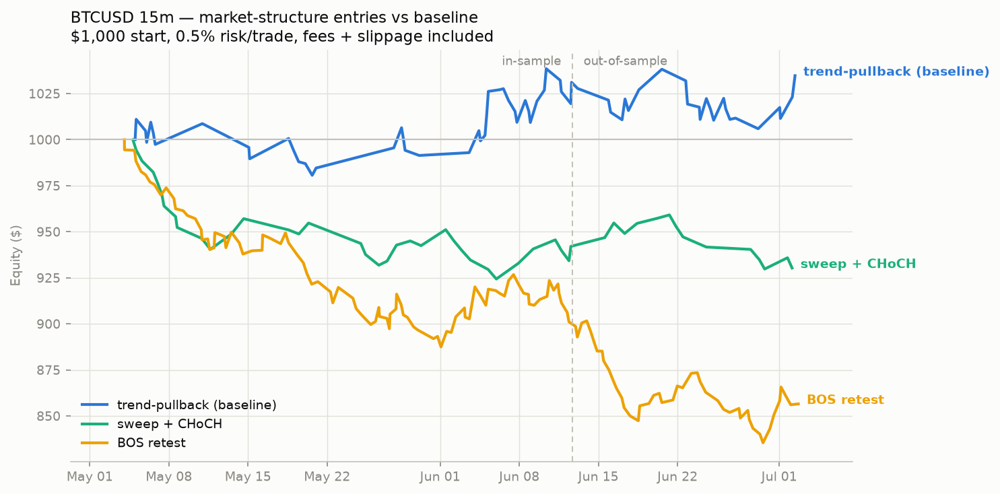

# Market-structure scalping — backtest report

Generated: 2026-07-02 16:36 UTC

Two mechanical 'smart money' entry models tested on 60 days of 15m Delta Exchange data, with maker/taker fees and slippage:

- **sweep + CHoCH** — 1h swing low/high swept by a wick that closes back
  inside, confirmed by a close beyond the sweep bar's local extreme.
  Entry next bar; stop at the sweep extreme (the exact invalidation
  point); take-profit at 2R.
- **BOS retest** — close through a confirmed swing level, limit entry on
  the retest of the broken level; stop beyond the last opposite swing.

| symbol   | strategy                  | phase             |   trades |   trades_per_day |   win_rate_% |   profit_factor |   avg_win_$ |   avg_loss_$ |   total_return_% |   max_drawdown_% |
|:---------|:--------------------------|:------------------|---------:|-----------------:|-------------:|----------------:|------------:|-------------:|-----------------:|-----------------:|
| BTCUSD   | trend-pullback (baseline) | full 60d          |       67 |             1.12 |         41.8 |            1.16 |        9.18 |        -5.7  |             3.47 |            -3.14 |
| BTCUSD   | trend-pullback (baseline) | in-sample 40d     |       42 |             1.05 |         45.2 |            1.23 |        8.66 |        -5.8  |             3.11 |            -3    |
| BTCUSD   | trend-pullback (baseline) | out-of-sample 20d |       25 |             1.25 |         36   |            1.04 |       10.27 |        -5.55 |             0.35 |            -3.11 |
| BTCUSD   | sweep + CHoCH             | full 60d          |       49 |             0.82 |         34.7 |            0.6  |        6.02 |        -5.38 |            -6.97 |            -7.56 |
| BTCUSD   | sweep + CHoCH             | in-sample 40d     |       35 |             0.88 |         31.4 |            0.56 |        6.68 |        -5.48 |            -5.79 |            -7.56 |
| BTCUSD   | sweep + CHoCH             | out-of-sample 20d |       14 |             0.7  |         42.9 |            0.71 |        4.81 |        -5.08 |            -1.25 |            -3.06 |
| BTCUSD   | BOS retest                | full 60d          |      135 |             2.25 |         34.1 |            0.62 |        5.03 |        -4.21 |           -14.35 |           -16.45 |
| BTCUSD   | BOS retest                | in-sample 40d     |       91 |             2.27 |         31.9 |            0.6  |        5.3  |        -4.11 |           -10.14 |           -11.25 |
| BTCUSD   | BOS retest                | out-of-sample 20d |       44 |             2.2  |         38.6 |            0.65 |        4.58 |        -4.44 |            -4.69 |            -7.34 |
| ETHUSD   | trend-pullback (baseline) | full 60d          |       86 |             1.43 |         36   |            0.9  |        9.28 |        -5.78 |            -3.04 |            -7.03 |
| ETHUSD   | trend-pullback (baseline) | in-sample 40d     |       57 |             1.43 |         36.8 |            0.94 |        9.26 |        -5.76 |            -1.3  |            -7.03 |
| ETHUSD   | trend-pullback (baseline) | out-of-sample 20d |       29 |             1.45 |         34.5 |            0.84 |        9.31 |        -5.81 |            -1.76 |            -5.25 |
| ETHUSD   | sweep + CHoCH             | full 60d          |       60 |             1    |         25   |            0.46 |        7.01 |        -5.04 |           -12.18 |           -13.38 |
| ETHUSD   | sweep + CHoCH             | in-sample 40d     |       39 |             0.97 |         28.2 |            0.54 |        6.94 |        -5.03 |            -6.44 |            -8.63 |
| ETHUSD   | sweep + CHoCH             | out-of-sample 20d |       21 |             1.05 |         19   |            0.34 |        7.22 |        -5.07 |            -6.13 |            -6.13 |
| ETHUSD   | BOS retest                | full 60d          |      133 |             2.22 |         32.3 |            0.6  |        5.01 |        -3.97 |           -14.21 |           -15.49 |
| ETHUSD   | BOS retest                | in-sample 40d     |       88 |             2.2  |         29.5 |            0.46 |        4.56 |        -4.11 |           -13.63 |           -14.13 |
| ETHUSD   | BOS retest                | out-of-sample 20d |       45 |             2.25 |         37.8 |            0.94 |        5.71 |        -3.67 |            -0.67 |            -3.13 |



## Verdict

Both market-structure entry models had **negative expectancy after
fees in every tested configuration** (a wider grid — swing widths 3/5/8,
5m/15m timeframes, 1h/4h liquidity levels, 2R/3R/liquidity targets —
was scanned during research with the same outcome). The entries are
'exact' in definition, but precision of definition is not the same as
edge. The trend-pullback baseline remains the default strategy.

To experiment with it anyway (paper mode):

```bash
DELTA_STRATEGY=structure python run_bot.py
```
