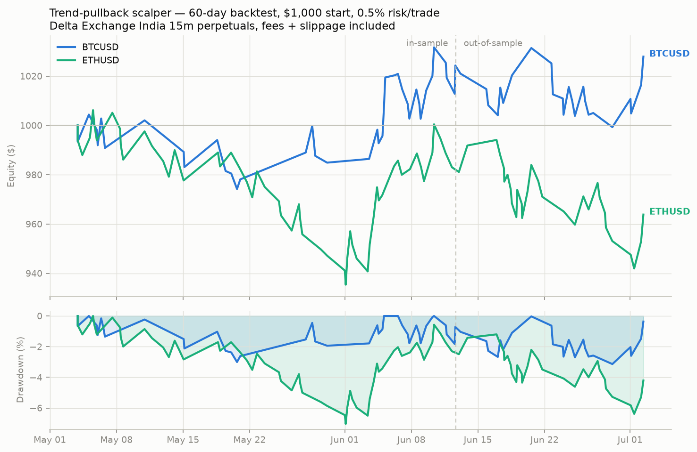

# Scalping agent — backtest performance report

Generated: 2026-07-02 16:26 UTC

- Strategy: trend-pullback (EMA20/50/100 + RSI cross, ATR stop 1.5x / TP 2.50R, 32-bar time exit)
- Timeframe: 15m | Costs: maker entry 0.02% + taker exit 0.05% + 0.02% slippage per side
- Sizing: 0.5% of equity risked per trade, max leverage 3.0x
- Conservative fill model: stop fills first when a bar touches stop and target.

| symbol   | phase             |   trades |   trades_per_day |   win_rate_% |   profit_factor |   avg_win_$ |   avg_loss_$ |   total_return_% |   max_drawdown_% |
|:---------|:------------------|---------:|-----------------:|-------------:|----------------:|------------:|-------------:|-----------------:|-----------------:|
| BTCUSD   | full 60d          |       68 |             1.13 |         41.2 |            1.12 |        9.11 |        -5.68 |             2.79 |            -3.14 |
| BTCUSD   | in-sample 40d     |       43 |             1.07 |         44.2 |            1.17 |        8.6  |        -5.8  |             2.43 |            -3    |
| BTCUSD   | out-of-sample 20d |       25 |             1.25 |         36   |            1.04 |       10.2  |        -5.51 |             0.35 |            -3.11 |
| ETHUSD   | full 60d          |       87 |             1.45 |         35.6 |            0.89 |        9.22 |        -5.75 |            -3.62 |            -7.03 |
| ETHUSD   | in-sample 40d     |       58 |             1.45 |         36.2 |            0.91 |        9.21 |        -5.74 |            -1.89 |            -7.03 |
| ETHUSD   | out-of-sample 20d |       29 |             1.45 |         34.5 |            0.84 |        9.25 |        -5.78 |            -1.76 |            -5.25 |

## Honest read of these numbers

This strategy is roughly breakeven-to-slightly-positive after realistic
costs. The out-of-sample period is materially weaker than in-sample —
the classic signature of a small, unstable edge. **Do not treat this as
a money-printing machine.** Recommended path: run it in paper mode for
2–4 weeks, compare paper results to the backtest, and only consider tiny
live size if paper tracks the backtest.
