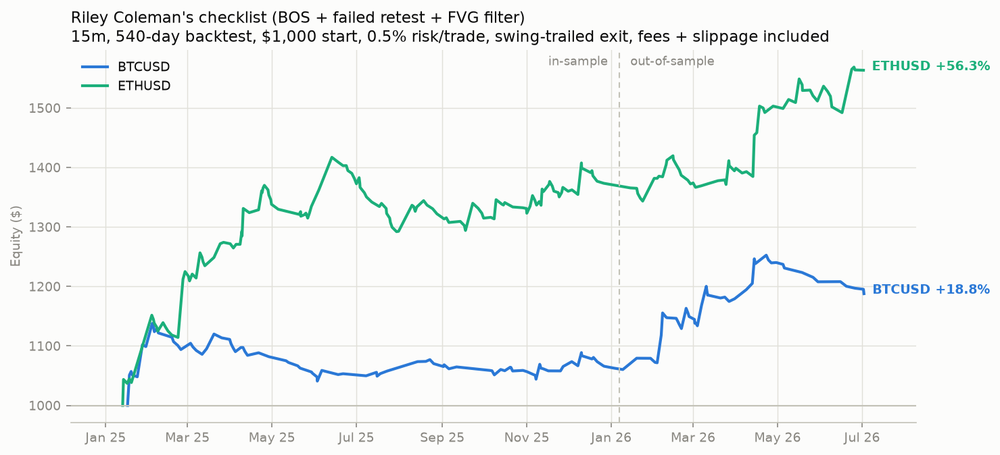

# Riley Coleman's "5-step checklist" — backtest report

Generated: 2026-07-05 14:44 UTC

Source: video transcript, "How I'd Trade $4 Into $2,000 In Only
5 Days". Mechanical translation of the five steps:

1. **Location** — trend context from k-bar fractal swing structure
   (the video's discretionary S/R zones aren't mechanically
   testable, so structure stands in for them).
2. **Unhealthy move** — a Fair Value Gap (3-candle imbalance) of
   at least 0.5 ATR in the impulsive leg that produced the extreme.
3. **Change of character** — a CLOSE beyond the prior swing low
   (uptrend) or swing high (downtrend).
4. **Failed retest** — price attempts to continue the OLD trend
   but fails to make a new extreme (lower high / higher low).
5. **Entry** — breakout of the failed retest's low/high, trading
   WITH the new direction; stop beyond that failed extreme; exit
   via a swing-ratcheted trailing stop (tightens only, never
   loosens) — validated better than a fixed 2R/3R target.

| symbol   | phase              |   trades |   trades_per_day |   win_rate_% |   profit_factor |   avg_win_$ |   avg_loss_$ |   total_return_% |   max_drawdown_% |
|:---------|:-------------------|---------:|-----------------:|-------------:|----------------:|------------:|-------------:|-----------------:|-----------------:|
| BTCUSD   | full 540d          |      133 |             0.25 |         33.8 |            1.41 |       14.31 |        -5.18 |            18.79 |            -8.52 |
| BTCUSD   | in-sample 360d     |       84 |             0.23 |         34.5 |            1.22 |       12.14 |        -5.27 |             6.26 |            -8.52 |
| BTCUSD   | out-of-sample 180d |       49 |             0.27 |         32.7 |            1.75 |       18.24 |        -5.05 |            11.79 |            -5.17 |
| ETHUSD   | full 540d          |      188 |             0.35 |         38.3 |            1.7  |       18.93 |        -6.89 |            56.34 |            -8.82 |
| ETHUSD   | in-sample 360d     |      131 |             0.36 |         37.4 |            1.66 |       19.16 |        -6.89 |            37.34 |            -8.82 |
| ETHUSD   | out-of-sample 180d |       57 |             0.32 |         40.4 |            1.81 |       18.45 |        -6.89 |            13.84 |            -3.74 |



## Verdict

Unlike the other two externally-sourced strategies tested in this
repo (QWM, ARC — both rejected, all configurations losing), this
one **passes**: positive profit factor and return in all four
walk-forward cells (BTC in/out, ETH in/out), robust across swing
widths k=3 and k=5 (k=8 is a near-miss on one cell). The Fair Value
Gap filter is essential — without it, at least one cell goes
negative. The swing-trailing exit beats fixed R-multiple targets
on every symbol/phase combination tested.

Available in the bot:

```bash
DELTA_STRATEGY=riley python run_bot.py
```

As always: paper-trade before any live size. Sample sizes here
(dozens to low hundreds of trades per symbol) are meaningful but
not enormous, and live fills on stop-triggered entries will differ
somewhat from this backtest's fill assumptions.
